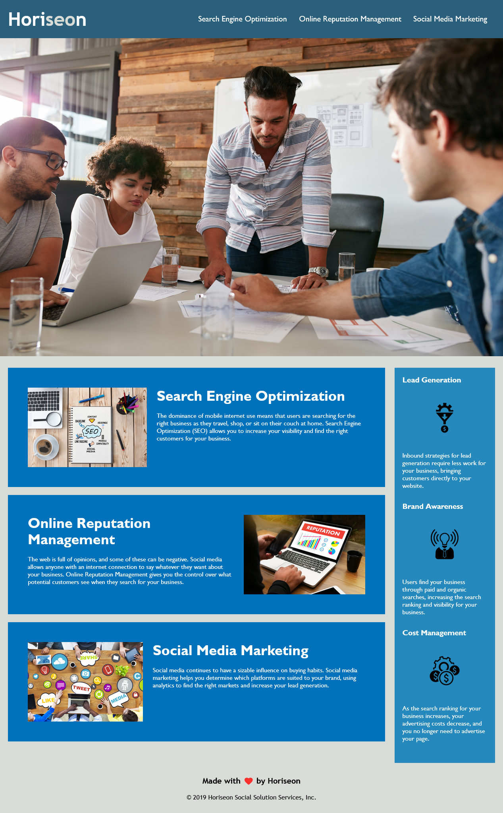

# Module 1 Challenge

## Table of Contents

- [Overview](#overview)
  - [The challenge](#the-challenge)
  - [User Story](#user-story)
  - [Acceptance Criteria](#acceptance-criteria)
  - [Screenshot](#screenshot)
  - [Links](#links)
- [My process](#my-process)
  - [Built with](#built-with)
  - [What I learned](#what-i-learned)
  - [Continued development](#continued-development)
  - [Useful resources](#useful-resources)
- [Author](#author)
- [Acknowledgments](#acknowledgments)
​

## Overview
This weeks challenge was to refactor the given code.
​
### The challenge

​Refactor the code to make it more accessible by using semantic HTML elements. Alongside this cleaning up the CSS to make it cleaner

### User Story

```
AS A marketing agency
I WANT a codebase that follows accessibility standards
SO THAT our own site is optimized for search engines​
```

### Acceptance Criteria
​
```
GIVEN a webpage meets accessibility standards
WHEN I view the source code
THEN I find semantic HTML elements
WHEN I view the structure of the HTML elements
THEN I find that the elements follow a logical structure independent of styling and positioning
WHEN I view the icon and image elements
THEN I find accessible alt attributes
WHEN I view the heading attributes
THEN they fall in sequential order
WHEN I view the title element
THEN I find a concise, descriptive title
```
​
### Screenshot
​


### Links
​
- Solution URL: [Solution](https://github.com/lafflin/Homework-1)
- Live Site URL: [Site](https://lafflin.github.io/Homework-1/)
​
## My process
​
1. First I started with adding alt attributes to all the images in the HTML and cleaned up some of the CSS by combining some repeating class selectors.
2. I added semantic HTML elements and continued working on cleaning the CSS up. During this the header image (#hero) broke.
3. While I worked to better the Semantic HTML I also changed many of the non-repeating classes to id's.
4. In order to fix the top image, I first undid some of my CSS changes to get it to function normally, but after my session with my tutor, I was able to find a clean way to fix the issue in the least lines possible.
5. The final thing I did was make a README


### Built with
​
- HTML
- CSS


### What I learned

- I learned a lot about how to better use Semantic HTML elements, and when to best use specific ones.
- I learned about the CSS point system, as well as how to organize my code efficiently, using DRY as a guiding principle
- I learned markdown through the process of making this file, with help from our TA Scott and my tutor Sachin.

### Continued development

- The number one thing I need to work on more would be CSS. It can be difficult for me to visualize what will happen when I write code, meaning I need to simply spend more time working on CSS to get a better grasp on it.
- Another thing I need some work on is markdown, but I am confident that given time and repetition I will pick it up easily.

### Useful resources
- [For Semantic HTML](https://medium.com/@zac_heisey/7-alternatives-to-the-div-html-tag-7c888c7b5036) - This helped me mainly because it simply listed many of the Semantic HTML elements with small descriptions, making it perfect to help with replacing the divs in the assignment.
- [For the README](https://www.makeareadme.com/#acknowledgments) - This tool that my tutor gave to me was instrumental in creating my README, allowing me to quickly see what I was typing rendered in markdown. Will definetely continue using this in the future.

## Author

- Linkedin - [Max McLaughlin](https://www.linkedin.com/in/max-mcla/)

## Acknowledgments
- Scott Nelson, one of our TA's, for providing a template for the README
- Angie Soto, a classmate, for providing the link to the Semantic HTML elements above
- Sachin Jhaveri, my tutor, for helping me fix the #hero image, giving me resources for markdown, and for helping me with my semantic HTML
- Manny, our instructor, for being thorough these first few weeks and helping those who are falling behind to make sure we are all on the same page still